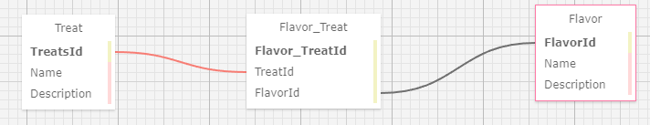
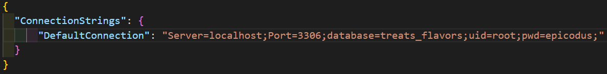

# Pierre's Sweet and Savory Confectionary

### A C-sharp application that keeps track of Treats, Flavors and Users for Pierre

### By Shaun Kent

## Technologies Used

* C#

* .NET 5.0

* Git/Github

* AspNet Core(Model, View, Controller)

* MySQL

* EntityCore Framework

* Identity Framework

* Bootstrap

## Description

A C# application that keeps track of Mr. Pierre's treats and flavor profiles using Entity Core Framework to manage MySql database. The application also allows Mr. Pierre to track users who register and login to his site, this is achieved by using Identity framework a Asp.Net dependency. 

The relationship between the Treats and Flavors is a many-to-many relationship

* A treat can have many flavor profiles
* A flavor profile can be in many treats

## Schema

## Setup/Instillation Requirements

* Download .NET 5.0 SDK for Windows:`https://dotnet.microsoft.com/download/dotnet/thank-you/sdk-5.0.102-windows-x64-installer` 

* Download .NET 5.0 SDK for Mac: `https://dotnet.microsoft.com/download/dotnet/thank-you/sdk-5.0.100-macos-x64-installer`

* Open command line in directory where you want the project stored.

* In the command line enter: `git clone https://github.com/SKona306/PierresSweetAndSavoryTreats.Solution.git`

* Open the newly cloned project directory in code editor of choice.

* Create you own database by:

1. If Needed download dotnet entityframework to device.

2. To download, in command line on root directory paste `dotnet tool install --global dotnet-ef --version 5.0.10`

3. To recreate the database enter `dotnet ef database update` in command line

* Cd into the `Bakery` directory and create a file by entering `touch appsettings.json` in command line

* Navigate to the `appsettings.json` file and enter: 

* Run Application:
1. `cd` to root directory
2. In console enter: `cd Bakery`
3. To build the project in the console enter: `dotnet build` 
4. To run the project in the console enter: `dotnet run`
5. To see application in browser press CTRL + click http link that appears after `dotnet run`
6. To exit program press CTRL + c

## Feature

* To Navigate between pages use nav bar:

## Bugs in Application
* No known bugs.
## License 

[MIT](https://choosealicense.com/licenses/mit/)

## Contact Information

* shaunkent81@gmail.com